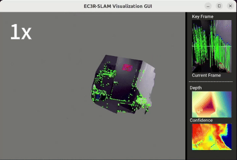
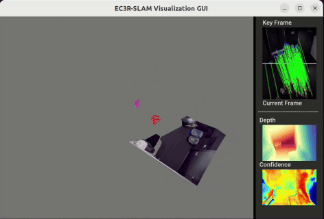

<!-- PROJECT LOGO -->
<h1 align="center" style="display: flex; align-items: center; justify-content: center; flex-wrap: wrap;">
  
  EC3R-SLAM: Efficient and Consistent Monocular Dense SLAM with Feed-Forward 3D Reconstruction
</h1>


  <p align="center">
   <strong>Lingxiang Hu<sup>1</sup></strong></a>
    ·
    <strong>Naima Ait Oufroukh<sup>1</sup></strong></a>
    ·
    <strong> Fabien Bonard<sup>1</sup></strong></a>
    ·
<strong> Raymond Ghandour<sup>2</sup></strong></a>
  </p>
  <p align="center">
      <strong><sup>1 </sup>IBISC Lab, Université Paris-Saclay, France,  <sup>2 </sup> American University of the Middle East, Kuwait, 
      <strong><h4 align="center"><a href="https://arxiv.org/html/2510.02080v1" target="_blank">Paper</a> | <a href="https://h0xg.github.io/ec3r/" target="_blank">Project Website</a></h4></strong>
  </strong></p>

## 📝 TODO

- [x] 📄 Upload paper  
- [ ] 💻 Upload our code (Fast3R version)  
- [ ] 💻 Upload our code (VGGT version)


## Tracking
<p align="center">
    
</p>

## Mapping
<p align="center">
    
</p>


## Citation

If you find our code or paper useful, please cite
```bibtex
@article{Hu2025EC3R,
  title        = {EC3R-SLAM: Efficient and Consistent Monocular Dense SLAM with Feed-Forward 3D Reconstruction},
  author       = {Hu, Lingxiang and Ait Oufroukh, Naima and Bonardi, Fabien and Ghandour, Raymond},
  year         = {2025},
  eprint       = {arXiv:2510.02080v1},
  archivePrefix = {arXiv},
  primaryClass = {cs.CV}
}
```
## Contact
Contact [Lingxiang Hu](mailto:hulxhlx@gmail.com) for questions, comments and reporting bugs.
